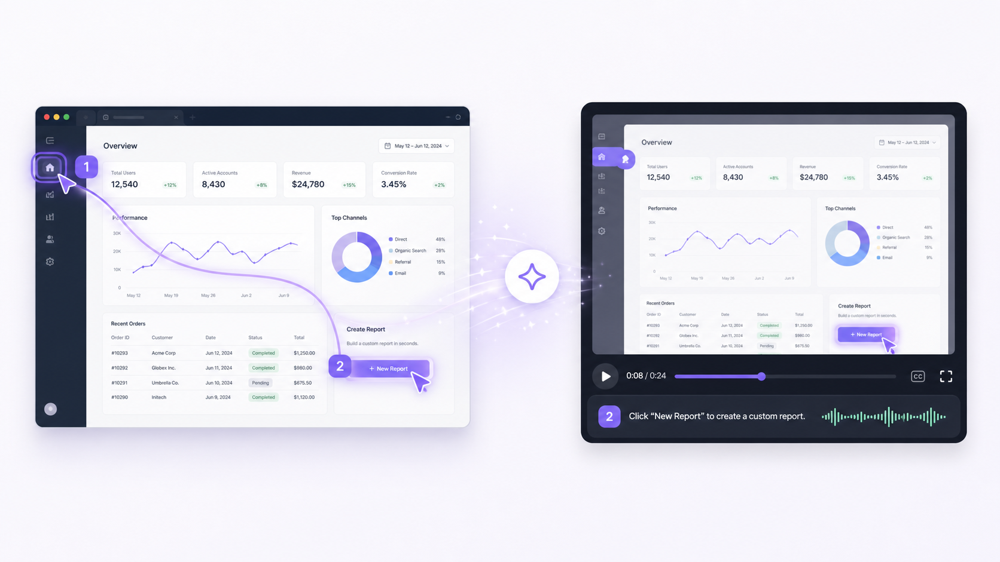

# Holo Tutorial

> Turn a software workflow into a polished narrated tutorial.



Holo Tutorial explores a web application, identifies the important moments in a requested workflow, writes a concise teaching script, generates natural narration, and renders the result as an animated MP4.

Paste an application URL, describe what should be explained, and choose a voice, delivery style, and target duration. Holo handles the browser workflow, visual direction, narration, rendering, and private delivery.

## What it does

- Performs real workflows in a controlled browser session with H Company computer use.
- Captures the screen before and after each meaningful action.
- Reconstructs actions, purposes, visible results, and completion states.
- Normalizes browser coordinates and creates adaptive target highlights.
- Adds smooth camera framing, cursor travel, click feedback, spotlight focus, and before/after transitions.
- Builds scene-level teaching scripts from the observed workflow.
- Generates natural voice-over with Gradium.
- Renders a shareable 1280×720 MP4 with FFmpeg.
- Publishes videos as private Google Cloud Storage objects with expiring signed URLs.

## How it works

```text
Application URL + workflow
          │
          ▼
H controlled browser session
          │
          ├── observations and actions
          └── structured teaching report
          │
          ▼
Workflow reconstruction
before → action → after → result
          │
          ├── visual direction
          └── narration script
          │
          ▼
Gradium voice generation
          │
          ▼
FFmpeg animated composition
          │
          ▼
Private signed video URL
```

## Tutorial controls

- **Feature or workflow:** the specific task Holo should demonstrate. When omitted, Holo selects a useful feature.
- **Narrator:** choose from the available Gradium voices.
- **Delivery:** professional, warm, energetic, or calm.
- **Opening line:** optional exact wording for the start of the tutorial.
- **Target length:** 15, 30, 45, 60, or 90 seconds.

## Technology

- Next.js 15 and React 19
- H Company computer-use API
- Gradium speech synthesis
- Sharp for raster composition
- FFmpeg for animation and MP4 rendering
- Google Cloud Run, Secret Manager, and Cloud Storage

## Local development

Requirements:

- Node.js 20+
- FFmpeg and FFprobe
- H Company API key
- Gradium API key

Create a local environment file from the safe template:

```bash
cp .env.example .env
```

Set `H_API_KEY` and `GRADIUM_API_KEY`, then install and run:

```bash
npm install
npm run dev
```

Open [http://localhost:3000](http://localhost:3000). When `HOLO_ACCESS_CODE` is unset locally, any non-empty beta code is accepted.

## Quality checks

```bash
npm test
npm run lint
npm run build
```

## Deploy to Google Cloud Run

Authenticate the Google Cloud CLI and select a project:

```bash
gcloud auth login
gcloud config set project YOUR_PROJECT_ID
```

Keep vendor credentials in the local `.env`; the deployment script copies their values into Secret Manager and never includes `.env` in the source image:

```bash
./scripts/deploy-cloud-run.sh
```

Optional deployment variables include `GOOGLE_CLOUD_REGION`, `CLOUD_RUN_SERVICE`, `VIDEO_BUCKET`, and `CLOUD_RUN_SERVICE_ACCOUNT`.

## Security model

- `.env`, `.env.*`, credentials, generated videos, and local artifacts are excluded from Git.
- `.env` and local artifacts are excluded from the Docker build context.
- Vendor credentials are available only to server-side modules.
- Cloud Run reads credentials from Google Secret Manager.
- Generated videos remain private and are shared through seven-day signed URLs.
- The public generation endpoint requires an independent beta access code.
- Browser sessions remain on the submitted hostname.
- Controlled workflows may change designated test data, but purchases, authentication changes, and unrequested external communication remain prohibited.

## Project structure

```text
app/                  Next.js UI and generation API
components/           Shared interface components
lib/h-company.ts      Controlled browser capture
lib/scenes.ts         Workflow reconstruction and scripting
lib/gradium.ts        Voice generation
lib/media.ts          Animated video composition
lib/storage.ts        Private video publishing
scripts/              Deployment and diagnostics
tests/                Unit tests
```

---

The README presentation image was generated with OpenAI image generation for this project.
